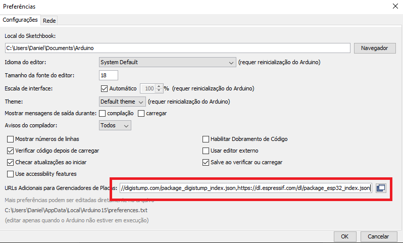
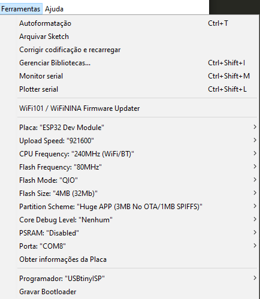
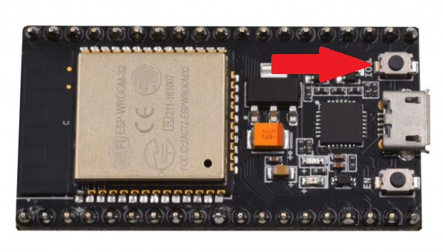

# Detector de presença BLE com integração ao Home Assistant

  Este repositório contém o código do projeto final da matéria [MAC0546/6929 - Fundamentos da Internet das Coisas (2020)](https://edisciplinas.usp.br/course/view.php?id=82628) e instruções para uso e compilação.
## Objetivo
  O objetivo desse projeto é permitir que, a partir do endereço MAC de um dispositivo Bluetooth, verificar se ele está ou não presente em um determinado local. 

  Foi implementado um _binary_sensor_ do Home Assistant da seguinte forma:  
  Para cada dispositivo rastreado, ele envia ON para `homeassistant/binary_sensor/ble_presence_00-00-00-00-00-00/state` (sendo `00-00-00-00-00-00` o endereço MAC do dispositivo rastreado em questão) ao detectar a presença, e OFF quando ele não está mais presente por um número determinado de scans. Para aumentar a quantidade de dispositivos compatíveis, esse projeto foi implementado como um _binary_sensor_ ao invés de um módulo de _room_presence_.

  Com isso, você pode detectar a presença ou não de determinados indivíduos em um ambiente. Caso você possua mais sensores e mais Zonas registradas no Home Assistant, também é possível rastrear em qual delas o indivíduo está.


↓


## Instruções

### Pré requisitos

Para utilizar este projeto você vai precisar de um módulo ESP32 programável e uma instância do Home Assistant ([veja aqui como instalar](https://www.home-assistant.io/getting-started/)) com uma integração de MQTT (caso você ainda não tenha recomendo utilizar o [Mosquitto](https://github.com/home-assistant/addons/blob/master/mosquitto/DOCS.md)). Você vai precisar também da [IDE Arduino](https://www.arduino.cc/en/Main.Software) instalada.

### Instalando dependências

Para poder usar a IDE Arduino com o ESP32, você precisa baixar as especificações e ferramentas da placa. Para isso, abra a IDE Arduino e clique em `Arquivo → Configurações`, e no campo _URLs Adicionais para Gerenciadores de Placas_ adicione a seguinte URL:  
`https://dl.espressif.com/dl/package_esp32_index.json`  
e clique em ok.



Depois disso, vá até `Ferramentas → Placa → Gerenciador de Placas` e procure por ESP32 e a instale.

### Configurando

Abra o sketch BLE_presence_detector e adicione à seção de configurações (no topo do arquivo) as seguintes linhas, substituindo-as pelos valores adequados à sua rede:

```cpp
#define SSID "NOME_DA_SUA_REDE"
#define PASSWORD  "SENHA_DA_SUA_REDE"
#define MQTTSERVER "192.168.1.123"
#define MQTTPORT 1883

// caso você esteja usando Mosquitto, esse pode ser também um usuário do Home Assistant.
#define MQTTUSER "usuariomqtt"
#define MQTTPASSWORD "senhamqtt"

// Adicione seus endereços MAC abaixo
BLEAddress tracked_addresses[] = {
    BLEAddress("00:00:00:00:00:00"),
    BLEAddress("11:11:11:11:11:11")
};
```

Os BLEAddress acima são os endereços MAC dos dispositivos a serem rastreados. Caso você não saiba qual é o MAC de seus dispositivos, você pode executar o sketch `BLE_scan` para verificar quais são os dispositivos encontrados (ele as exibirá no Monitor Serial). Logo abaixo, há mais algumas configurações que podem ser editadas caso necessário.

### Enviando o sketck ao ESP32

Este passo vai variar muito dependendo de qual placa você está utilizando. Caso esteja utilizando um NodeMCU ESP32 no Windows, siga as instruções abaixo.

Conecte seu ESP32 no computador utilizando um cabo microUSB e verifique em qual porta COM ele foi adicionado. Em seguida, configure o upload no menu `Ferramentas` conforme a imagem abaixo:



OBS: é importante alterar a _Partition Scheme_ para `Huge Apps`, pois caso contrário faltará espaço na hora de enviar o sketch.

Em seguida, clique em `Carregar` na barra superior. Após a compilação, você verá algo como:
```
O sketch usa 1331410 bytes (42%) de espaço de armazenamento para programas. O máximo são 3145728 bytes.
Variáveis globais usam 57884 bytes (17%) de memória dinâmica, deixando 269796 bytes para variáveis locais. O máximo são 327680 bytes.
esptool.py v2.6
Serial port COM8
Connecting........_____....._____....._____....._____.....
```

Quando aparecer o `Connecting...`, pressione o botão `BOOT` do seu ESP32 por alguns segundos e o upload será iniciado.



Se tudo der certo, você deve receber uma notificação no Home Assistant que um novo dispositivo foi encontrado.

------
### Ignorando linhas no commit

Isso é mais uma curiosidade para caso deseje contribuir com esse projeto. Você pode utilizar os comandos abaixo (junto ao .gitattributes presente nesse repositório) para filtrar linhas que contenham conteúdo sensível dos seus commits. 

[Veja mais detalhes nessa resposta do stack overflow.](https://stackoverflow.com/questions/16244969/how-to-tell-git-to-ignore-individual-lines-i-e-gitignore-for-specific-lines-of)

`git config filter.gitignore.clean "sed '/#gitignore/d'"`  
`git config filter.gitignore.smudge cat`  
